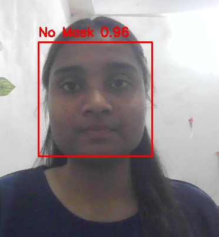
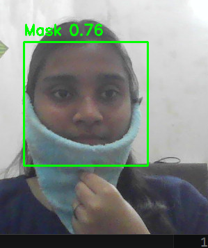

# Face Mask Detection using Machine Learning (HOG + SVM)

## Overview

This project detects whether a person is wearing a face mask or not using a machine learning approach.
It uses **Histogram of Oriented Gradients (HOG)** for feature extraction and a **Support Vector Machine (SVM)** classifier for prediction.

The system works in two stages:

1. Training a model using labeled dataset (with_mask / without_mask)
2. Real-time face mask detection using webcam

---

## Features

* Face detection using Haar Cascade
* Mask classification using trained SVM model
* Real-time detection via webcam
* Displays bounding box with label and confidence

---

## Project Structure

```
face_mask_detection/
│
├── dataset/
│   ├── images/           # All images
│   └── annotations/      # XML annotation files
│
├── train_model.py        # Train the model
├── face_mask_detection.py # Real-time detection
├── mask_model.pkl        # Saved trained model
└── README.md
```

---

## Requirements

Install the following Python libraries:

```
pip install opencv-python numpy scikit-learn scikit-image joblib
```

---

## Dataset

* Dataset contains images and XML annotations
* Each XML file includes:

  * bounding box coordinates
  * label: `with_mask` or `without_mask`

---

## How It Works

### 1. Training Phase

* Reads images and corresponding XML files
* Extracts face regions using bounding boxes
* Converts to grayscale and resizes to 128x128
* Extracts HOG features
* Trains SVM classifier
* Saves model as `mask_model.pkl`

---

### 2. Detection Phase

* Captures video from webcam
* Detects faces using Haar Cascade
* Extracts HOG features from detected faces
* Predicts mask / no mask using trained model
* Displays result with bounding box

---

## How to Run

### Step 1: Train the model

```
python train_model.py
```

### Step 2: Run detection

```
python face_mask_detection.py
```

Press **'q'** to exit webcam.

---

## Model Details

* Feature Extraction: HOG (Histogram of Oriented Gradients)
* Classifier: SVM (Support Vector Machine)
* Kernel: Linear / RBF (depending on configuration)
* Input Size: 128x128 grayscale images

---

## Accuracy

* Achieved Accuracy: **~88%**
* Accuracy depends on:

  * dataset quality
  * lighting conditions
  * face detection accuracy

---

## Limitations

* Not robust for extreme angles or occlusions
* Performance depends on Haar Cascade detection
* Limited compared to deep learning models (CNNs)

---

## Future Improvements

* Replace SVM with CNN (deep learning)
* Use larger and more diverse dataset
* Improve accuracy using data augmentation
* Deploy as web or mobile application

---
## Demo

### With Mask


### Without Mask


## Conclusion

This project demonstrates a complete machine learning pipeline:
data preprocessing → feature extraction → model training → real-time deployment.

It is a good foundational project for understanding computer vision and ML concepts.
